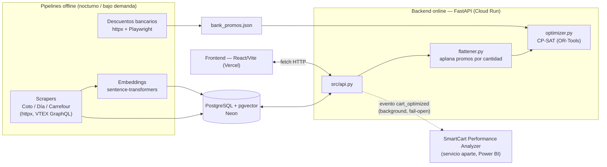

# Arquitectura de SmartCart

> Este documento describe **cómo funciona SmartCart hoy**: tecnologías,
> entradas/salidas de cada etapa del pipeline, y el flujo completo desde que se
> scrapea un supermercado hasta que un usuario ve el carrito repartido entre
> tiendas. Es la referencia técnica vigente del proyecto.
>
> `docs/smartcart_spec.md` es distinto: es la propuesta técnica original
> (arquitectura pensada, roadmap por semanas, un frontend en Streamlit que ya
> no existe) y se conserva como documento histórico, no como spec al día.
> `docs/TODO.md` es el backlog razonado — este documento no lo repite.

---

## 1. Qué es SmartCart

Los supermercados argentinos no cobran lo mismo por el mismo producto, y esa
dispersión de precios no es chica: el mismo paquete de yerba puede diferir 20-30%
entre Coto, Día y Carrefour, y ninguna cadena gana en todo. Comparar a mano —
abrir tres sitios, buscar cada producto, sumar— no es algo que alguien haga
para una compra semanal de treinta ítems.

SmartCart automatiza esa comparación de punta a punta. El usuario arma un
carrito con lenguaje natural ("puré de papas", no un SKU exacto), y el sistema
calcula **cómo repartir esa lista entre las tres cadenas para gastar lo
mínimo posible**, tratando como restricciones duras las cosas que en la vida
real lo son: el mínimo de compra de cada tienda, la cobertura de envío, y sólo
contando descuentos que el usuario realmente puede usar (una tarjeta que
declaró, una membresía que tiene). El resultado no es sólo "el total más
bajo": es un desglose por tienda, con las promociones que se aplicaron, el
costo de envío, y una comparación contra lo que hubiera costado en la tienda
más cara.

El problema tiene dos partes bien distintas, y el proyecto está organizado
alrededor de esa separación:

1. **Tener un catálogo unificado y actualizado** de las tres cadenas, con
   precios y promociones al día — un problema de *ingesta de datos*, que
   corre offline, de noche, sin que ningún usuario lo espere.
2. **Resolver, para un carrito puntual, la combinación de compra más barata**
   — un problema de *optimización combinatoria* con restricciones reales
   (mínimos de compra, promos condicionadas a cantidad, descuentos atados a
   tarjeta), que corre online, en el momento en que el usuario pide el
   resultado.

## 2. Vista de alto nivel

El repositorio son dos procesos independientes que se hablan por HTTP:

| Capa | Tecnología | Dónde corre |
| --- | --- | --- |
| Base de datos | PostgreSQL + extensión `pgvector` (HNSW, cosine ops) | Neon (serverless, escala a cero) |
| Backend | Python, FastAPI, `psycopg[binary,pool]`, Pydantic, `pandas`, `sentence-transformers` (`all-MiniLM-L6-v2`), Google OR-Tools (CP-SAT), Tesseract vía `pytesseract` | Google Cloud Run (contenedor Docker, scale-to-zero) |
| Scraping de catálogo | `httpx` contra APIs internas: BFF REST de Coto, GraphQL persisted-query de VTEX (Día y Carrefour) | GitHub Actions (cron nocturno) |
| Scraping de promos bancarias | `httpx` (Coto) + `Playwright`/Chromium (Día y Carrefour, que renderizan la grilla en el cliente) | Manual / bajo demanda |
| Frontend | React 19, Vite, Tailwind CSS v4 (config CSS-first, sin `tailwind.config.js`), React Router, `react-leaflet` (mapa de dirección), estado con Context + `useReducer`/`useState` (sin Redux/Zustand/React Query), `fetch` nativo (sin axios) | Vercel |
| Analítica | Servicio HTTP separado (`SmartCart Performance Analyzer`), Postgres propio en `:5433`, ingest en `:8001`, alimenta Power BI | Fuera de este repo |

No hay autenticación de usuario en ningún punto: el "perfil" (dirección,
tarjetas, membresías) vive en `localStorage` del navegador y viaja completo en
cada request. Eso simplifica todo lo demás — no hay tabla de usuarios, no hay
sesión que expire, no hay backup que hacer — pero también fija el techo del
proyecto: el historial de compras y el carrito no sobreviven un "borrar datos
del sitio", y no hay noción de "el mismo usuario en otro dispositivo".

## 3. El pipeline de datos, etapa por etapa

### 3.1 Scraping de catálogo (`src/scrapers/`)

**Tecnología:** `httpx`, peticiones directas a las APIs internas que cada
sitio ya usa para pintar su propia grilla — no hay scraping de HTML.

- **Coto** (`scraper_coto.py`) — BFF REST propio, paginado.
- **Día** y **Carrefour** (`scraper_dia.py`, `scraper_carrefour.py`) — mismo
  motor de e-commerce, VTEX, con una *persisted query* GraphQL
  (`productSearchV3`, `sha256Hash` fijo) que ninguna de las dos puede pedir
  con campos nuevos sin que el hash rote del lado del store.

**Input:** una clave de categoría por tienda (un id `catv...` para Coto, un
slug de URL para Día/Carrefour). Las claves que efectivamente se barren no las
elige cada scraper: salen de `src/shelves.py` (ver 3.1.1).

**Output:** por producto, precio de lista, promociones crudas (formato propio
de cada API), EAN, nombre, marca, tamaño/peso, disponibilidad. Cada scraper
normaliza su forma propia a un diccionario común antes de persistir (etapa
3.2).

Detalle no obvio: el criterio de "esta categoría terminó bien" vs. "esto
falló a medio camino" es explícito (`CategoryScrapeError`, ver
`src/scrapers/errors.py`) porque de esa distinción depende qué se puede podar
después sin borrar catálogo vivo por error (etapa 3.2, poda).

#### 3.1.1 Qué se scrapea: la tabla de góndolas (`src/shelves.py`)

Es la única taxonomía del proyecto. Una fila (`Shelf`) = un slug canónico
("yerba-mate") + una etiqueta ("Yerba y mate") + una sección de menú
("Desayuno y merienda") + las claves que identifican esa góndola en cada una
de las tres tiendas. Hoy son **60 góndolas** en ocho secciones (las últimas, Frutas y verduras y Carnes), con **123**
claves de Coto, **91** de Día y **69** de Carrefour (una góndola puede necesitar más de una clave por
tienda, porque las tres taxonomías anidan a profundidades distintas).

Esta tabla existe porque la unificación es por EAN: un producto sólo es
comparable entre cadenas si las tres barrieron la misma góndola. El slug
canónico es también lo que resuelve, con una sola igualdad SQL (`shelf = %s`,
sin operadores de solapamiento ni vocabulario por tienda):

- qué categorías scrapea cada tienda (`keys_for_store`),
- de qué góndola es un producto (`unified_products.shelf`),
- qué puede sustituir a qué (`src/substitutions.py`, `src/strategic_swaps.py`),
- qué dibuja el mega-menú (`GET /categories`).

Pescadería y panadería de elaboración propia quedan afuera a propósito: se
venden por peso con códigos internos de cada tienda y nunca unifican por EAN.

Verdulería y carnicería (`frutas`, `verduras`, `carnes`, `pollo`) tienen el mismo
problema y entran igual, por otra puerta: `src/fresh_items.py`.

#### 3.1.2 Frescos emparejados a mano (`src/fresh_items.py`)

**Entrada:** los productos de las cuatro góndolas frescas, con el SKU de cada
tienda. **Salida:** para los SKUs listados en la tabla, un `unified_id =
fresh_{slug}` compartido entre cadenas, con nombre y medida canónicos
(`resolve_identity()`, llamada desde `save_store_products`).

El código de barras de un producto pesado en balanza es un número de circulación
restringida (prefijo 20-29) que cada cadena inventa: la misma manzana roja es
`2000529000008` en Coto, `2490039000000` en Día y `2300397000002` en Carrefour.
`normalize_ean()` los descarta, así que sin la tabla cada fresco es una oferta de
una sola tienda.

La tabla la cura una persona con criterio estricto (misma variedad y calidad
común, sin líneas premium, sin piezas vendidas con peso aproximado, un SKU por
tienda, al menos dos cadenas). `python -m src.scripts.curar_frescos` baja las
góndolas en vivo, propone candidatos por embedding y reporta los SKUs que una
cadena dejó de publicar. Los embeddings sólo proponen: medido, "ananá" queda más
cerca de "nalga" de lo que muchos pares correctos quedan entre sí.

### 3.2 Normalización y persistencia (`src/database.py`, `src/schema.py`, `src/promotion_parser.py`, `src/ean.py`, `src/dietary_parser.py`, `src/size_parser.py`)

**Tecnología:** `psycopg3` (con `psycopg_pool` cuando está instalado) contra
Postgres. El esquema (`src/schema.py`) es DDL idempotente (`CREATE TABLE IF
NOT EXISTS`, `ADD COLUMN IF NOT EXISTS`) — no hay migraciones versionadas, la
base se auto-repara al conectar.

**Input:** la lista de productos crudos que devolvió un scraper para una
categoría (etapa 3.1).

**Output:** dos tablas.

- `unified_products` — una fila por EAN, cruzando tiendas. Guarda el nombre
  unificado (pisado por quien escribió último), la góndola canónica, los
  flags dietarios, el tamaño normalizado y el embedding (etapa 3.3, llenado
  después).
- `store_products` — una fila por `(store_id, store_sku)`: la oferta real de
  esa tienda para ese producto (precio, stock, promos normalizadas, URL,
  nombre *tal cual lo escribe esa tienda*).

Transformaciones que pasan en esta etapa, cada una resolviendo un problema
real de los datos crudos:

- **EAN** (`src/ean.py`) — Coto a veces publica el GTIN-14 del *bulto*, no el
  EAN-13 del producto; se deriva el EAN-13 sólo cuando el dígito verificador
  del GTIN-14 valida. Un código de más de 13 caracteres que no pasa esa
  validación se descarta (el producto queda sin unificar, no se inventa una
  clave). Códigos de 8 a 12 dígitos (UPCs) se dejan tal cual: las tres cadenas
  los truncan igual, así que igual unifican entre sí.
- **Tamaño/unidad** (`src/size_parser.py`) — normaliza cualquier variante
  (`"kg"`, `"gr"`, `"Kg"`, derivado del precio por peso) a exactamente tres
  valores posibles: `'g'`, `'ml'`, `'un'`. Todo lo que compara tamaños entre
  productos (sustituciones, precio por unidad de medida) depende de que ese
  vocabulario nunca crezca.
- **Promociones** (`src/promotion_parser.py`) — traduce el formato propio de
  cada tienda a uno de cuatro tipos estándar que el resto del sistema conoce:
  `direct_discount`, `conditional_discount_flat`, `conditional_discount` (ej.
  "2da unidad al 50%"), `multi_buy` (ej. 3x2). Carrefour tiene un caso
  especial: su gap de precio no siempre es una promo abierta, a veces es el
  precio con membresía Mi Carrefour, y eso queda marcado con
  `requires_membership` para que el optimizador no lo aplique a quien no
  declaró esa tarjeta.
- **Flags dietarios** (`src/dietary_parser.py`) — `is_gluten_free`/`is_vegan`
  sólo se ponen en `TRUE` ante una frase explícita ("sin TACC", "100%
  vegetal") en texto que describe *ese* producto (nombre, marca, categoría,
  campos estructurados de la tienda) — nunca en `description`/marketing, que
  puede describir un producto hermano. `FALSE` es "sin evidencia", no una
  afirmación negativa.

**Poda de productos discontinuados:** `save_store_products` sólo hace upsert,
así que un producto que una tienda dejó de vender se queda en la base para
siempre si nadie lo borra. `prune_missing_store_products` compara lo que se
vio en el barrido contra lo que ya había, y borra lo que no apareció —
acotado a las categorías que terminaron bien (una categoría que falló no le
cuesta la poda al resto de la tienda) y con un freno duro si el borrado
superaría el 30% del catálogo en ese alcance (señal de que algo se rompió, no
de que el catálogo cambió de verdad).

### 3.3 Embeddings (`src/embeddings.py`)

**Tecnología:** `sentence-transformers`, modelo `all-MiniLM-L6-v2` (384
dimensiones), corriendo localmente (sin llamada a ninguna API externa).

**Input:** `"{brand} {name}"` de cada producto en `unified_products` sin
embedding todavía.

**Output:** un vector de 384 dimensiones por producto, en la columna
`name_embedding` (tipo `vector(384)` de `pgvector`, con índice HNSW y
operador de distancia coseno).

Es una etapa aparte y explícita — no corre sola con el scraping — porque un
producto sin embedding es invisible para `GET /search`: existe en la base
pero nadie lo puede encontrar por texto libre.

### 3.4 El mega-menú (nota histórica)

Hubo una etapa intermedia (`src/category_tree.py`, ya eliminada) que mezclaba
por embeddings las taxonomías completas de Coto y Día en un árbol de ~15
categorías de primer nivel. Sobre un catálogo acotado a 20-49 góndolas, casi
ningún nodo de ese árbol tenía productos reales, y el click caía a una
búsqueda semántica del *nombre de la categoría* — no del producto. Hoy el
mega-menú (`GET /categories`) dibuja directamente las góndolas de
`src/shelves.py`: cada hoja tiene productos por construcción, porque la tabla
de góndolas es la misma que decide qué se scrapea.

### 3.5 Logística de Coto (`src/coto_logistics.py`)

**Tecnología:** `httpx`, contra un endpoint público del propio sitio de Coto
(`GET /rest/model/atg/actors/cProfileActor/getCobertura`, sin login).

**Input:** latitud/longitud del domicilio de entrega (cuando el usuario
completó el onboarding de dirección).

**Output:** si Coto cubre esa dirección, y un costo de envío — el tarifario
publicado (`ENTREGA_RAPIDA_COSTO`), porque no existe un endpoint anónimo que
devuelva el costo real por dirección (ese cálculo depende de un carrito y un
turno ya autenticados del lado de Coto).

Es **fail-open**: si el endpoint no responde o devuelve algo inesperado (la
SPA de Coto contesta 200 con HTML para cualquier ruta desconocida, por eso se
valida el `content-type`), Coto sigue compitiendo con el costo de fallback por
zona en vez de quedar excluido — un tercero caído no debe borrar la mitad del
catálogo de la respuesta.

### 3.6 API de búsqueda y optimización (`src/api.py`)

**Tecnología:** FastAPI. Carga el modelo de embeddings una vez al arrancar
(`lifespan`) y lo mantiene en memoria para toda la vida del proceso.

Endpoints, con su input/output real:

| Endpoint | Input | Output |
| --- | --- | --- |
| `GET /search?q=` | texto libre | lista de productos, ordenada por relevancia semántica ponderada por disponibilidad multi-tienda (ver más abajo) |
| `GET /categories` | — | las 60 góndolas agrupadas por sección |
| `GET /category/{slug}` | slug de góndola | productos de esa góndola (404 si el slug no existe en la tabla) |
| `POST /products/by-ids` | lista de `unified_id` (hasta 100) | esos productos, en el mismo orden, tal como existen hoy, más la descripción de alguna tienda para la ficha (usado para resolver nombre/precio del carrito y del historial, que en `localStorage` sólo guardan el id) |
| `GET /deals` | `limit`, membresías y sección opcionales | los productos con mayor descuento de hoy, con `discount_pct` (sección de la home, filtrable por sección) |
| `GET /demo-cart` | — | un carrito de ejemplo armado por el backend con el catálogo del día (para el botón "Probar con un carrito de ejemplo") |
| `GET /logistics/coto/coverage?lat=&lng=` | coordenadas | si Coto cubre esa dirección |
| `POST /price-preview` | ítems del carrito + membresías | precio neto por tienda a la cantidad pedida, evaluando promos |
| `POST /optimize` | carrito, coordenadas opcionales, tarjetas/membresías declaradas, costos de envío por zona, supermercados que el usuario deshabilitó | el reparto óptimo entre tiendas, o 400 con motivo si es inviable |
| `POST /receipt/parse` | una foto de ticket (`multipart/form-data`) | por línea leída: el texto OCR y, si hubo un match confiable, el producto del catálogo |

**Búsqueda (`GET /search`):** no es sólo "los vecinos más cercanos por
coseno". Es *retrieve-then-rerank* en una sola query SQL: primero trae un
`pool` de 100 candidatos por pura distancia (lo único que el índice HNSW
puede acelerar), después reordena ese pool restando un bonus acotado
(`STORE_BONUS = 0.01`, tope `STORE_BONUS_CAP = 2`) por cada tienda extra que
lo vende — para que un producto disponible en las tres cadenas no pierda
sistemáticamente contra uno idéntico en relevancia pero vendido en una sola.
El bonus está calibrado contra el spread real de distancias del catálogo, no
elegido a ojo: subirlo demasiado termina ordenando por cantidad de tiendas en
vez de por relevancia semántica.

El SQL vive en `src/search.py`, que también usa `medir_busqueda.py`, y tiene
un segundo modo **híbrido**: suma una mitad léxica (tsvector sobre
`unified_products.name_tsv`) y fusiona las dos listas por Reciprocal Rank
Fusion. Está apagado (`DEFAULT_SEARCH_MODE = "denso"`) hasta que la medición
demuestre que no pierde contra el denso (`docs/TODO.md`, ítem 5).

**Optimización (`POST /optimize`):** ver 3.6.1 más abajo — es el corazón del
proyecto y tiene su propia etapa (`flattener.py` + `optimizer.py`).

**OCR de tickets (`POST /receipt/parse`):** el más nuevo de los flujos. Lee
una foto con Tesseract local (`src/receipt_parser.py`, `--psm 6` + upscaling
2x, que es lo que marcó la diferencia sobre una impresora térmica fotografiada
con el celular) y recorta cada línea a lo que con certeza *no* es parte de un
nombre de producto (precio final, %IVA entre paréntesis, código de barras,
cantidad al principio) — no intenta reconstruir el nombre exacto, eso lo hace
el paso siguiente. Cada línea limpia se embebe con el mismo modelo de
`/search` y se busca el vecino más cercano en `unified_products`; por debajo
de `RECEIPT_MATCH_MAX_DISTANCE = 0.35` se considera un match confiable. Es
deliberadamente OCR y no un modelo de visión pago — el endpoint no tiene
login, así que un costo por imagen sería gasto sin techo — y por eso mismo el
resultado **nunca** toca el carrito solo: el frontend (`ReceiptScanModal.jsx`)
muestra cada línea para que el usuario la confirme, la corrija con una
búsqueda manual, o la descarte, antes de "Agregar al carrito".

#### 3.6.1 Aplanamiento de promos + optimización (`src/flattener.py`, `src/optimizer.py`)

**Tecnología:** `pandas` para el aplanamiento, Google OR-Tools (**CP-SAT**)
para el modelo de optimización.

**Input:** el carrito (`unified_id` + cantidad por línea), las tarjetas y
membresías que el usuario declaró, los costos de envío por zona, y —si hay
coordenadas— el resultado de la etapa 3.5 (cobertura y costo real de Coto).

**Paso 1 — aplanar (`flatten_cart_prices`):** para cada línea del carrito y
cada tienda que la vende, evalúa todas las promos aplicables a la cantidad
pedida (respetando membresía/tarjeta) y devuelve el costo neto más barato para
esa cantidad exacta. El resultado es una matriz simple de "costo por producto
por tienda" — sin promos, sin condicionales — que es lo único que entra al
solver.

**Paso 2 — optimizar (`optimize_cart`):** modelo CP-SAT con una variable
booleana por cada par (producto, tienda) más una variable "tienda activa" por
tienda, minimizando `subtotal + envío − descuento bancario`, sujeto a:

- cada producto se compra en exactamente una tienda de las que lo venden,
- si una tienda tiene productos asignados, su total tiene que superar el
  mínimo de compra de esa cadena (restricción dura, no una penalización),
- el descuento bancario se aplica según el banco/tarjeta declarado y el día
  de la semana (etapa 3.8).

**Output:** el reparto por tienda (qué se compra dónde, a qué precio, con qué
promo), el total neto, el ahorro contra la tienda más cara que vendía cada
producto (`price_savings`, sólo informativo — no es comparable contra el
total), sugerencias de reemplazo semántico, y — cuando aplica — el resultado
de la heurística de cierre de tienda (etapa 3.7). Una combinación inviable
(por ejemplo, un producto que sólo vende una tienda excluida) no da un 500:
da 400 con el motivo real, no un mensaje genérico de "subí el monto".

### 3.7 Heurística de cierre de tienda (`src/strategic_swaps.py`)

**Tecnología:** re-invocación del propio `optimize_cart` (no una segunda
implementación del costo), más una consulta de reemplazos semánticos acotada
a la misma góndola.

**Por qué existe:** el solver es óptimo, pero el carrito de entrada es fijo.
Si un solo producto barato de Carrefour obliga a abrir esa tienda, el mínimo
de compra de Carrefour puede arrastrar el resto del carrito ahí aunque
convenga menos — el solver no puede "sugerir" cambiar el carrito, sólo
resolverlo tal como está.

**Input:** el resultado ya óptimo de `/optimize`.

**Proceso:** por cada tienda activa en el split, busca sus "anclas" (productos
que **sólo** esa tienda vende, entre las no excluidas). Si hay alguna, busca
un reemplazo de la misma góndola, con unidad compatible y peso entre 0.5x y
2x el original, y vuelve a correr el optimizador con esa tienda excluida y el
carrito sustituido. Una tienda sin anclas se descarta sin ninguna consulta:
cerrarla ya era un punto factible que el solver óptimo evaluó y rechazó.

**Output:** una lista (`strategic_swaps`, normalmente vacía) de "si cambiás X
por Y, podés sacar la tienda Z y ahorrar $N".

### 3.8 Descuentos bancarios (`src/promotions/`, `src/bank_promos.py`)

**Tecnología:** `httpx` (Coto, endpoint público tipo ATG) + `Playwright`/
Chromium (Día y Carrefour, que renderizan la grilla de promos del lado del
cliente, sin equivalente en JSON).

**Input:** las páginas/endpoints de promociones bancarias de cada cadena.

**Output:** `src/scrapers/bank_promos.json` — un archivo, no una tabla de
Postgres, con el descuento (banco/billetera, porcentaje, tope, día de la
semana) por cadena.

Es un pipeline **separado** del scraping de catálogo (corre bajo demanda, no
cada noche) porque estos descuentos no cuelgan de ningún producto: son
condiciones "toda la tienda, tal tarjeta, tal día". `load_bank_promos(today)`
filtra por el día de la semana antes de que la tabla llegue al solver — el
modelo CP-SAT no tiene noción de calendario, así que ese filtro es lo que le
permite a Carrefour (con descuentos que sólo corren ciertos días) participar
sin un caso especial. Es fail-open: un archivo ausente o corrupto cae a una
tabla de respaldo fija en vez de dejar a todas las tiendas sin descuento
bancario.

### 3.9 Analítica (`src/analytics.py`)

**Tecnología:** `httpx`, disparado en un `BackgroundTask` de FastAPI con
timeout de 2s.

**Input:** el resultado de cada `POST /optimize` (éxito o infactible).

**Output:** un evento `cart_optimized` enviado a un servicio HTTP externo —
**SmartCart Performance Analyzer**, un proyecto aparte con su propia base
Postgres (`:5433`) e ingesta (`:8001`) que alimenta un tablero de Power BI.

La regla de diseño es que la analítica **nunca puede romper ni frenar**
`/optimize`: todo el envío es fail-open (falla y sólo loguea), y por eso el
caso de "carrito inviable" responde con un `JSONResponse` explícito en vez de
un `raise HTTPException` — FastAPI descarta los `BackgroundTasks` adjuntos
cuando el endpoint levanta una excepción, así que un `raise` ahí dejaría de
emitir exactamente el evento que mide el KPI de "% carritos inviables".

### 3.10 Orquestación desatendida (`src/scripts/orchestrator.py`, `src/logging_setup.py`, `src/scraper_telemetry.py`, `ops/`)

**Tecnología:** el mismo scraping de 3.1-3.3, envuelto con logging a archivo,
telemetría en Postgres, manejo de señales (`SIGTERM`) y pre-flight de la
base.

**Input:** ninguno propio — corre `run_scrapers.py` (los tres scrapers +
embeddings) con manejo de errores pensado para correr sin supervisión.

**Output:** filas de telemetría por corrida (`scraper_execution_logs`, una
por tienda + una para embeddings) con estado `SUCCESS`/`PARTIAL`/`FAILED`, y
logs con fecha en el nombre de archivo (no rotación por proceso, porque el
job corre unos minutos por noche y nunca cruza medianoche vivo).

**Dónde corre hoy:** GitHub Actions (`workflow_dispatch` + cron), contra
Neon. Hay un plan alternativo diseñado y documentado para correr en una VM
Oracle Cloud "Always Free" (`ops/oracle/`), bloqueado hoy por falta de
capacidad asignada por Oracle en la región — el estado exacto y la razón de
cada paso quedan en `ops/README.md`, no se repiten acá.

## 4. Frontend (`frontend/src`)

**Tecnología:** React 19 + Vite, Tailwind v4 (tokens de tema en
`src/index.css` bajo `@theme`, sin archivo de config aparte), React Router,
`react-leaflet` para el selector de dirección en mapa. Estado con Context +
`useReducer`/`useState` — sin Redux/Zustand/React Query — y `fetch` nativo
sobre wrappers finos en `api/` (`products.js`, `categories.js`,
`optimize.js`, `receipt.js`, ...).

Flujo de usuario, en el orden en que ocurre:

1. **Onboarding de dirección** (`components/onboarding/LocationModal.jsx`) —
   bloqueante la primera vez (geocodifica con Nominatim), reutilizable después
   para cambiar de dirección. Tiene salida ("seguir sin dirección") para no
   dejar la app inutilizable si Nominatim está caído. El segundo paso pregunta
   las membresías de supermercado (Club Día, Mi Carrefour…), porque cambian
   los precios que muestra la grilla desde el primer producto.
2. **Armado del carrito** — por búsqueda semántica (`/buscar`), navegando el
   mega-menú (`/categoria/:slug`), repitiendo del historial de compras
   (`context/HistoryContext.jsx`, guardado en `localStorage`), o escaneando
   un ticket (`components/receipt/ReceiptScanModal.jsx` → `POST
   /receipt/parse`). El carrito en sí (`context/CartContext.jsx`) sólo
   guarda `{unified_id: {name, quantity}}` — precio, imagen y disponibilidad
   se resuelven aparte contra el catálogo del día (`POST /products/by-ids`),
   nunca se cachean en el carrito.
3. **Perfil** (`context/ProfileContext.jsx`) — tarjetas, membresías y la
   dirección geocodificada. La zona de envío se **deriva** de la dirección
   (nunca se pregunta con un selector aparte), para que no se pueda declarar
   una zona distinta de donde realmente se va a entregar.
4. **Optimizar** (`/carrito` → `POST /optimize`) — muestra el reparto por
   tienda, el ahorro, avisos de cobertura/logística de Coto cuando aplican, y
   las sugerencias de reemplazo o cierre de tienda que haya devuelto el
   backend.

Cada optimización exitosa queda registrada en el historial de compras
(`localStorage`, ventana de sesión de 30 minutos para no fragmentar una
misma compra en varias entradas), que alimenta la sección "Comprar de nuevo"
de la home.

## 5. Testing

Los tests **no** son unitarios aislados: la mayoría levanta la app FastAPI
real (incluyendo el modelo de embeddings) y consulta un Postgres real ya
poblado. Por eso se dividen en dos grupos:

- **Puros** (sin base, sin modelo) — parsers y lógica de negocio aislada:
  promociones, taxonomía, flags dietarios, tamaños, EAN, el optimizador con
  matrices de precio fabricadas (`test_optimizer_correctness.py`, que incluye
  un oráculo de fuerza bruta para comparar contra el óptimo exacto), la
  orquestación (con `STORE_RUNNERS` mockeado).
- **Con base real** (y a veces con el modelo cargado) — los endpoints de la
  API, la búsqueda semántica y su ranking, la poda, la telemetría, el
  esquema.

`pytest.ini` fija `pythonpath = .`, así que el backend siempre se importa
como `src.<módulo>` en vez de con imports relativos.

## 6. Despliegue

| Componente | Dónde | Por qué |
| --- | --- | --- |
| Base de datos | Neon (Postgres + pgvector serverless) | Escala a cero; el sweep nocturno reconstruye el catálogo en ~30 min, así que no hace falta backup — la base es 100% derivada. |
| API | Google Cloud Run | RSS real medido ~413 MB bajo `/optimize`; entra cómodo en el tier gratis (180.000 vCPU-s/mes) con `--min-instances 0`. La imagen instala `torch` desde el índice CPU de PyTorch antes que nada, para no arrastrar el runtime de CUDA que trae el wheel de PyPI. |
| Frontend | Vercel | Deploy en segundos por push; separado de la API para no pagar un rebuild de ~10 min (con `torch` adentro) por cada cambio de UI. |
| Scraping nocturno | GitHub Actions (cron) | Sin costo de cómputo propio; ver 3.10 para el plan alternativo (Oracle) y su estado. |
| Analítica | Servicio aparte, fuera de este repo | Ver 3.9. |

Dos variables de entorno son las que evitan que el proyecto se quede sin
presupuesto gratuito de Neon: `SMARTCART_POOL_MIN_SIZE=0` (una conexión
persistente cuenta como actividad para Neon y evita que la base se suspenda,
consumiendo CU-hours las 24 horas) y `SMARTCART_POOL_MAX_IDLE` bajo (evita que
la última conexión de cada visita quede viva mucho más de lo necesario).

## 7. Límites conocidos y trabajo pendiente

No hay autenticación, no hay backup de datos de usuario (carrito e historial
viven sólo en `localStorage` del navegador), y Coto no expone un costo de
envío real por dirección para un cliente sin sesión (se usa el tarifario
publicado como estimación). El backlog completo, con el razonamiento detrás
de cada ítem pendiente, está en [`docs/TODO.md`](TODO.md).
